# MLOps Capstone: Weeks 1-4 - SMS Spam Detection Fundamentals

## 🎯 Project Overview

This capstone project brings together the core ML fundamentals from **Weeks 1-4** of the MLOps Learning Program:
- **[Week 1](./mlops-syllabus.md#week-1--ml-basics-i-introduction-to-models):** ML Basics I - Models, loss functions, gradient descent, hyperparameters
- **[Week 2](./mlops-syllabus.md#week-2--ml-basics-ii-model-evaluation):** ML Basics II - Classification metrics, evaluation, confusion matrix
- **[Week 3](./mlops-syllabus.md#week-3--feature-engineering):** Feature Engineering - Data transformation, categorical encoding, feature crosses
- **[Week 4](./mlops-syllabus.md#week-4--data-quality):** Data Quality & MLOps Intro - Train/test splits, overfitting, generalization

### What You'll Build
- ✅ **Binary Classification Model** for SMS spam detection using scikit-learn
- ✅ **Data Pipeline** with train/test splitting and preprocessing
- ✅ **Feature Engineering** with TF-IDF vectorization
- ✅ **Model Evaluation** using classification metrics (precision, recall, F1, confusion matrix)
- ✅ **MLflow Integration** for experiment tracking and model versioning
- ✅ **Jupyter Notebooks** for exploratory analysis and training
- ✅ **Local Training** with reproducible results

### Learning Objectives
By completing this project, you will:
1. Understand why **classification** is the right approach for spam detection (binary outcome)
2. Build a **data preprocessing pipeline** for text data
3. Apply **feature engineering** techniques (TF-IDF) to convert text to numerical features
4. Split data into **train and test sets** to evaluate generalization
5. Train multiple **classification models** with hyperparameter tuning
6. Evaluate models using **classification metrics** from Week 2
7. Track experiments and versions using **MLflow**
8. Understand why overfitting is a concern (theory for future stages)

---

## 🧠 Why Classification? (Not Regression or Clustering)

### The Problem
We need to classify SMS messages as either **spam** or **ham (not spam)**. This is a **binary classification problem**.

### Why Not Regression?
- **Regression** predicts continuous values (e.g., house price: $250,000)
- Our output is **discrete** (spam or not spam), not continuous
- Would produce meaningless values like 0.7 (neither 0 nor 1)

### Why Not Clustering?
- **Clustering** finds natural groups WITHOUT labels
- We have **labeled data** (spam vs. ham messages)
- We want **supervised learning** (learn from labeled examples)

### Why Classification?
- Output is **binary** (2 classes: spam / ham)
- We have **labeled training data**
- Goal is to **predict a category**, not a continuous value
- Perfect for **Naive Bayes, Logistic Regression, SVM** algorithms

**Algorithm Choice:**
- **Naive Bayes:** Fast, works well with text, assumes feature independence
- **Logistic Regression:** Interpretable, probabilistic, handles high-dimensional text data
- **SVM:** High accuracy, works with kernel tricks for non-linear patterns

---

## 📊 Project Flow (Weeks 1-4 Concepts)

```mermaid
graph TD
    Start["📥 Input: SMS Dataset"] --> Split["🔀 Week 4: Train/Test Split<br/>(80% / 20%)"]
    
    Split --> PreProc["🔧 Week 3: Preprocessing<br/>Lowercase, Tokenize, Remove Stopwords"]
    
    PreProc --> FeatEng["⚙️ Week 3: Feature Engineering<br/>TF-IDF Vectorization"]
    
    FeatEng --> ModelLoop["🔁 Week 1: Model Training<br/>Naive Bayes / LogReg / SVM<br/>with Hyperparameter Tuning"]
    
    ModelLoop --> Train["📚 Train Models<br/>on Training Data (80%)"]
    
    Train --> Eval["📊 Week 2: Evaluate on Test Data<br/>Accuracy, Precision, Recall, F1<br/>Confusion Matrix"]
    
    Eval --> MLFlow["🔗 Log to MLflow<br/>Metrics, Parameters, Model<br/>Versions"]
    
    MLFlow --> Report["📈 Generate Report<br/>Best Model Selection<br/>Generalization Analysis"]
    
    Report --> End["✅ Ready for Production<br/>(Future: Monitoring, Retraining)"]
    
    style Start fill:#e3f2fd
    style Split fill:#fff3e0
    style PreProc fill:#fff3e0
    style FeatEng fill:#fff3e0
    style ModelLoop fill:#f3e5f5
    style Train fill:#f3e5f5
    style Eval fill:#e8f5e9
    style MLFlow fill:#fce4ec
    style Report fill:#ede7f6
    style End fill:#c8e6c9
```



---

## 📋 Functional Requirements (Weeks 1-4)

| Week | Concept | FR | Requirement | Implementation |
|------|---------|----|----|---|
| **Week 1** | Model Basics | FR01 | Train classification models | Naive Bayes, LogReg, SVM with scikit-learn |
| **Week 1** | Hyperparameters | FR02 | Tune hyperparameters | GridSearchCV for optimal C, kernel, etc. |
| **Week 1** | Gradient Descent | FR03 | Use optimization algorithms | LogReg uses SGD internally |
| **Week 2** | Evaluation Metrics | FR04 | Calculate precision, recall, F1 | sklearn.metrics functions |
| **Week 2** | Confusion Matrix | FR05 | Generate confusion matrix | Visualize TP, FP, TN, FN |
| **Week 3** | Text Preprocessing | FR06 | Clean and normalize text | Lowercase, tokenize, remove stopwords |
| **Week 3** | Feature Engineering | FR07 | Convert text to features | TF-IDF vectorization |
| **Week 4** | Data Splitting | FR08 | Split train/test (80/20) | sklearn.model_selection.train_test_split |
| **Week 4** | Generalization | FR09 | Evaluate on unseen test data | Report metrics on test set only |
| **MLOps** | Experiment Tracking | FR10 | Log all experiments | MLflow tracking server |
| **MLOps** | Model Versioning | FR11 | Version models in registry | MLflow model registry |

---

## 📂 Project Structure

```
capstone-week1-4/
├── README.md (this file)
├── requirements.txt
├── .env.example
├── Makefile
│
├── data/
│   ├── raw/
│   │   └── smsspamcollection.csv      # Original dataset
│   └── processed/
│       ├── train.csv                  # 80% - used for training
│       └── test.csv                   # 20% - used for evaluation
│
├── notebooks/
│   ├── 01_data_exploration.ipynb      # Week 4: EDA, data quality
│   ├── 02_preprocessing_feature_eng.ipynb  # Week 3: Text cleaning & TF-IDF
│   ├── 03_model_training.ipynb        # Week 1: Train models
│   └── 04_model_evaluation.ipynb      # Week 2: Metrics & analysis
│
├── src/
│   ├── __init__.py
│   ├── config.py                      # Configuration
│   ├── data_loader.py                 # Load and split data
│   ├── preprocessing.py               # Text preprocessing (Week 3)
│   ├── feature_engineering.py         # TF-IDF vectorization (Week 3)
│   ├── training.py                    # Model training (Week 1)
│   ├── evaluation.py                  # Metrics & analysis (Week 2)
│   └── mlflow_utils.py                # MLflow integration
│
├── scripts/
│   ├── download_data.py               # Get dataset
│   ├── train_pipeline.py              # End-to-end training
│   └── create_train_test_split.py     # Week 4: Data splitting
│
├── tests/
│   ├── test_preprocessing.py
│   ├── test_feature_eng.py
│   ├── test_training.py
│   └── conftest.py
│
└── mlruns/                            # MLflow tracking (auto-created)
```

---

## 🚀 Quick Start

### 1. Environment Setup
```bash
# Clone and navigate
cd MLOps-Fundamentals-Capstone-Part1-Foundations

# Create virtual environment
python -m venv .venv
source .venv/bin/activate  # On Windows: .\.venv\Scripts\activate

# Install dependencies
pip install -r requirements.txt
```

### 2. Download Data
```bash
python scripts/download_data.py
# Dataset: UCI SMS Spam Collection (5,574 messages)
# Classes: 4,827 ham, 747 spam (13.4% spam rate)
```

### 3. Create Train/Test Split (Week 4)
```bash
python scripts/create_train_test_split.py
# Creates: data/processed/train.csv (4,459 msgs) and test.csv (1,115 msgs)
```

### 4. Run Jupyter Notebooks (Sequential)
```bash
jupyter notebook

# Open in order:
# 1. 01_data_exploration.ipynb        (Week 4: Understand data quality)
# 2. 02_preprocessing_feature_eng.ipynb (Week 3: Transform text to features)
# 3. 03_model_training.ipynb          (Week 1: Train & hyperparameter tune)
# 4. 04_model_evaluation.ipynb        (Week 2: Evaluate & analyze metrics)
```

### 5. Run Full Training Pipeline
```bash
# Start MLflow tracking server
mlflow server --host 0.0.0.0 --port 5000 &

# Run training script (trains all models, logs to MLflow)
python scripts/train_pipeline.py --experiment-name "week1-4-baseline"

# View results
# Open http://localhost:5000 in browser
```

---

## 📚 Learning Path: Weeks 1-4

### **[Week 1: ML Basics I - Models, Loss Functions, Gradient Descent, Hyperparameters](./mlops-syllabus.md#week-1--ml-basics-i-introduction-to-models)**

**What You'll Learn:**
- Models are functions that map input (text) → output (spam/ham)
- **Loss functions** measure prediction error (cross-entropy for classification)
- **Gradient descent** optimizes model weights to minimize loss
- **Hyperparameters** are settings we choose (e.g., learning rate, regularization strength C)

**Hands-On:**
```python
# Week 1: Training with different models and hyperparameters
from sklearn.naive_bayes import MultinomialNB
from sklearn.linear_model import LogisticRegression
from sklearn.svm import SVC

# Model 1: Naive Bayes (simple, fast)
nb_model = MultinomialNB()

# Model 2: Logistic Regression (uses gradient descent internally)
lr_model = LogisticRegression(
    C=1.0,              # Hyperparameter: regularization strength
    max_iter=1000,      # Hyperparameter: iterations of gradient descent
    solver='saga'       # Hyperparameter: optimization algorithm
)

# Model 3: SVM (support vector machine)
svm_model = SVC(
    C=1.0,              # Hyperparameter: regularization strength
    kernel='rbf',       # Hyperparameter: kernel type
    probability=True
)

# Train on features
models = [nb_model, lr_model, svm_model]
for model in models:
    model.fit(X_train_tfidf, y_train)
    # Internally uses gradient descent (LogReg, SVM)
```

**Key Insight:** Different models use different loss functions and optimization approaches, but all minimize error through gradient descent.

---

### **[Week 2: ML Basics II - Classification Metrics, Evaluation, Confusion Matrix](./mlops-syllabus.md#week-2--ml-basics-ii-model-evaluation)**

**What You'll Learn:**
- **Accuracy** alone is misleading (with imbalanced data, 87% accuracy by predicting all ham!)
- **Precision:** "Of messages we predicted as spam, how many were actually spam?"
- **Recall:** "Of all actual spam messages, how many did we catch?"
- **F1 Score:** Harmonic mean of precision & recall
- **Confusion Matrix:** TP, FP, TN, FN breakdown

**Hands-On:**
```python
# Week 2: Comprehensive evaluation
from sklearn.metrics import (
    accuracy_score, precision_score, recall_score, f1_score,
    confusion_matrix, classification_report
)

# Make predictions on test set
y_pred = model.predict(X_test_tfidf)

# Calculate metrics
accuracy = accuracy_score(y_test, y_pred)
precision = precision_score(y_test, y_pred)  # TP / (TP + FP)
recall = recall_score(y_test, y_pred)        # TP / (TP + FN)
f1 = f1_score(y_test, y_pred)                # 2 * (precision * recall) / (precision + recall)

# Confusion matrix
cm = confusion_matrix(y_test, y_pred)
# [[TN  FP]
#  [FN  TP]]

print(f"Accuracy:  {accuracy:.4f}")
print(f"Precision: {precision:.4f} (of predicted spam, % actually spam)")
print(f"Recall:    {recall:.4f} (of all spam, % we caught)")
print(f"F1 Score:  {f1:.4f} (balance of precision & recall)")
print(f"Confusion Matrix:\n{cm}")
```

**Key Insight:** For spam detection, high **recall** is important (don't miss spam), but high **precision** reduces false positives (legitimate emails marked as spam).

---

### **[Week 3: Feature Engineering - Text Preprocessing, Encoding, TF-IDF](./mlops-syllabus.md#week-3--feature-engineering)**

**What You'll Learn:**
- Raw text cannot be fed to models; must convert to numbers
- **Preprocessing:** Lowercase, remove punctuation, remove stopwords
- **TF-IDF (Term Frequency-Inverse Document Frequency):**
  - TF: How often a word appears in a message
  - IDF: How unique/rare the word is across all messages
  - High TF-IDF = important word for classification

**Hands-On:**
```python
# Week 3: Text preprocessing and feature engineering
import nltk
from nltk.corpus import stopwords
from sklearn.feature_extraction.text import TfidfVectorizer

# Preprocessing: Convert raw text to clean text
def preprocess_text(text):
    # Convert to lowercase
    text = text.lower()
    # Remove punctuation and tokenize
    tokens = nltk.word_tokenize(text)
    # Remove stopwords (common words like "the", "is", "and")
    stop_words = set(stopwords.words('english'))
    tokens = [w for w in tokens if w not in stop_words]
    return ' '.join(tokens)

# Apply preprocessing
texts_cleaned = [preprocess_text(text) for text in raw_texts]

# Feature Engineering: TF-IDF vectorization
tfidf_vectorizer = TfidfVectorizer(
    max_features=5000,           # Keep top 5000 features
    ngram_range=(1, 2),          # Unigrams and bigrams
    min_df=2,                    # Word must appear in ≥2 documents
    max_df=0.95                  # Word cannot appear in >95% of documents
)

X_tfidf = tfidf_vectorizer.fit_transform(texts_cleaned)
# Output: sparse matrix (5574 messages × 5000 features)
```

**Key Insight:** Features are automatically learned from data. "Free", "winner", "click" get high TF-IDF weights in spam messages.

---

### **[Week 4: Data Quality & Generalization - Train/Test Split, Overfitting](./mlops-syllabus.md#week-4--data-quality)**

**What You'll Learn:**
- **Train/Test Split:** Use 80% for training, 20% for final evaluation
- **Generalization:** Model must work on unseen data, not just training data
- **Overfitting:** Model memorizes training data instead of learning patterns
- **Data Quality:** Assume clean data for now (future stages handle data drift, labeling errors)

**Hands-On:**
```python
# Week 4: Train/test split and generalization
from sklearn.model_selection import train_test_split

# Split: 80% train, 20% test (random_state for reproducibility)
X_train, X_test, y_train, y_test = train_test_split(
    X_tfidf, y,
    test_size=0.2,
    random_state=42,
    stratify=y  # Keep class ratio (87% ham, 13% spam) in both splits
)

print(f"Train set: {X_train.shape[0]} messages")
print(f"Test set: {X_test.shape[0]} messages")

# Train on training data
model = LogisticRegression()
model.fit(X_train, y_train)

# Evaluate on training data (what we should NOT report)
train_accuracy = model.score(X_train, y_train)
print(f"Training Accuracy: {train_accuracy:.4f} (biased estimate)")

# Evaluate on test data (true generalization measure)
test_accuracy = model.score(X_test, y_test)
print(f"Test Accuracy: {test_accuracy:.4f} (unbiased estimate)")

# If train >> test, model is overfitting
if train_accuracy - test_accuracy > 0.05:
    print("⚠️ Warning: Model is likely overfitting")
else:
    print("✓ Model generalizes well to unseen data")
```

**Key Insight:** We **never** evaluate on training data. Test set is "unseen" and measures if the model learned general patterns or just memorized.

---

## 🔗 MLflow Integration

All experiments are logged to MLflow for tracking and versioning:

```bash
# Start tracking server
mlflow server --host 0.0.0.0 --port 5000

# View experiments and metrics at http://localhost:5000
```

**What Gets Logged:**
```python
import mlflow

with mlflow.start_run(experiment_id=exp_id):
    # Log hyperparameters
    mlflow.log_param("model_type", "logistic_regression")
    mlflow.log_param("C", 1.0)
    mlflow.log_param("max_iter", 1000)
    
    # Train model
    model.fit(X_train_tfidf, y_train)
    
    # Log metrics
    mlflow.log_metric("train_accuracy", train_acc)
    mlflow.log_metric("test_accuracy", test_acc)
    mlflow.log_metric("test_precision", precision)
    mlflow.log_metric("test_recall", recall)
    mlflow.log_metric("test_f1", f1)
    
    # Log model artifact
    mlflow.sklearn.log_model(model, "model")
```

---

## 🧪 Notebook Breakdown

### **Notebook 1: Data Exploration (Week 4)**
- Load raw dataset
- Check data quality (missing values, class distribution)
- Understand spam vs. ham characteristics
- Visualize text length, vocabulary size

**Output:** `data/processed/train.csv`, `data/processed/test.csv`

### **Notebook 2: Preprocessing & Feature Engineering (Week 3)**
- Clean text (lowercase, punctuation, stopwords)
- Apply TF-IDF vectorization
- Analyze feature importance
- Save vectorizer for future use

**Output:** `X_train_tfidf`, `X_test_tfidf`

### **Notebook 3: Model Training (Week 1)**
- Train Naive Bayes, Logistic Regression, SVM
- Hyperparameter tuning with GridSearchCV
- Log experiments to MLflow
- Compare models

**Output:** Trained models logged to MLflow

### **Notebook 4: Model Evaluation (Week 2)**
- Evaluate all models on test set
- Compute precision, recall, F1, confusion matrix
- Plot confusion matrix
- Select best model
- Analyze generalization

**Output:** Evaluation report, best model selected

---

## 🎯 Success Criteria (Weeks 1-4)

| Criterion | Target | How to Verify |
|-----------|--------|---------------|
| Train/Test Split | 80/20 | Check `data/processed/` file sizes |
| Preprocessing Works | 100% of messages cleaned | No errors in notebook 2 |
| Feature Engineering | 5000 TF-IDF features | Check vectorizer output shape |
| Model Training | 3+ models trained | MLflow UI shows ≥3 runs |
| Classification Metrics | Precision ≥ 0.90 | Week 2 notebook reports metric |
| Generalization | Test ≈ Train ± 5% | Compare train vs. test accuracy |
| Overfitting | Minimal (gap < 5%) | Verify train/test gap is small |
| MLflow Integration | All models logged | MLflow UI shows experiments |

---

## 🚀 What's Next? (Future Stages)

This capstone covers **Weeks 1-4 (Foundations)**. Future stages will add:

- **Week 5-6:** Model deployment, containerization, serving APIs
- **Week 7-8:** Continuous training, automated retraining, drift detection
- **Week 9-10:** Monitoring, alerting, performance degradation
- **Week 11-12:** Model governance, compliance, multi-model management

Each stage builds on this foundation!

---

## 📚 Key Takeaways

1. **Classification is the right approach** for spam detection (binary outcome)
2. **Train/Test split** ensures we measure generalization, not memorization
3. **Feature engineering** (TF-IDF) transforms text into numbers for models
4. **Classification metrics** (precision, recall, F1) matter more than accuracy with imbalanced data
5. **Hyperparameters** control how models learn; must tune them
6. **MLflow tracking** makes experiments reproducible and comparable
7. **Overfitting is a real risk** (theory; mitigation in future stages)

---

## 🔗 Resources

### Syllabus Reference
- **[Week 1 Details](./mlops-syllabus.md#week-1--ml-basics-i-introduction-to-models)** - ML Basics I: Introduction to Models
- **[Week 2 Details](./mlops-syllabus.md#week-2--ml-basics-ii-model-evaluation)** - ML Basics II: Model Evaluation
- **[Week 3 Details](./mlops-syllabus.md#week-3--feature-engineering)** - Feature Engineering
- **[Week 4 Details](./mlops-syllabus.md#week-4--data-quality)** - Data Quality & MLOps Introduction

### External Learning Materials
- **Week 1:** [Linear Regression](https://developers.google.com/machine-learning/crash-course/linear-regression) & [Logistic Regression](https://developers.google.com/machine-learning/crash-course/logistic-regression) from Google ML Crash Course
- **Week 2:** [Classification](https://developers.google.com/machine-learning/crash-course/classification)
- **Week 3:** [Working with Text Data](https://scikit-learn.org/stable/modules/feature_extraction.html#text-feature-extraction)
- **Week 4:** [Datasets & Overfitting](https://developers.google.com/machine-learning/crash-course/overfitting)
- **MLflow:** [MLflow Documentation](https://mlflow.org/docs/latest/index.html)
- **Scikit-learn:** [Classification Metrics](https://scikit-learn.org/stable/modules/model_evaluation.html)

---

## 📞 Support

- Review Jupyter notebooks step-by-step
- Check MLflow UI at http://localhost:5000
- Run tests: `pytest tests/ -v`
- Debug with print statements and breakpoints

